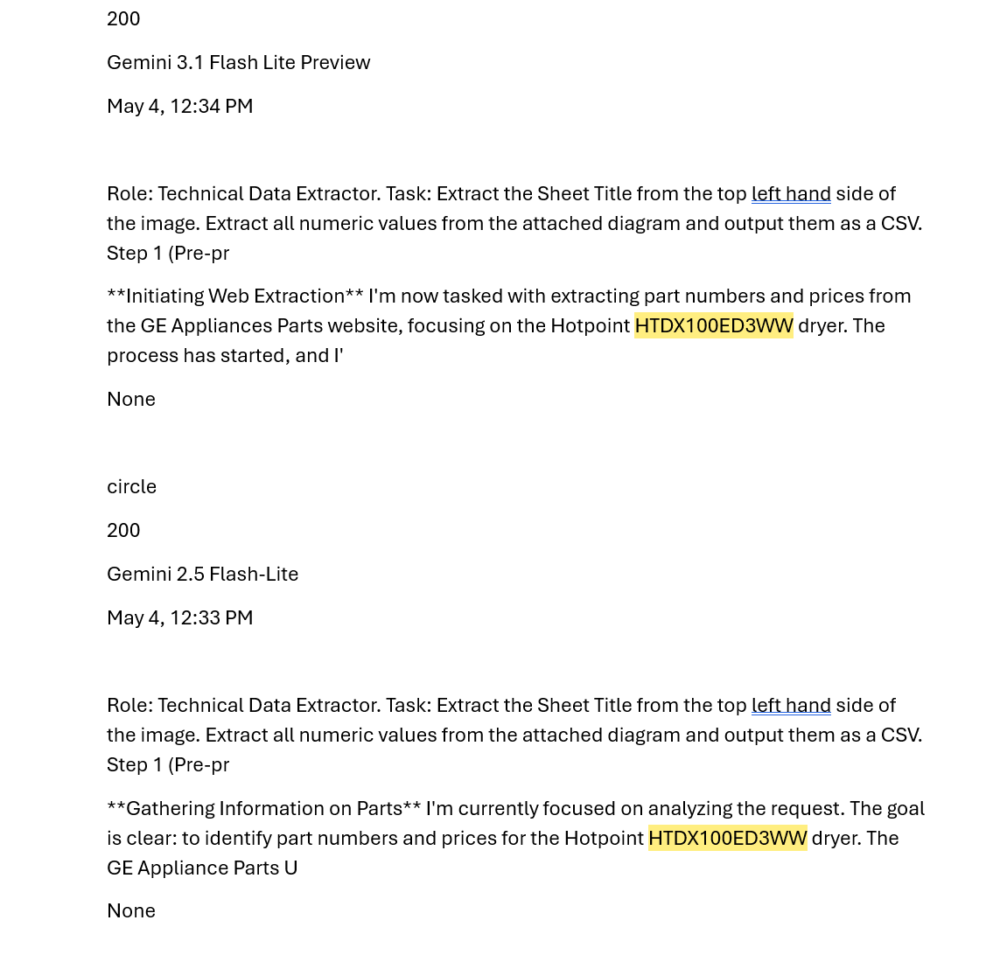

# BOM Cockpit Cheat Sheet

Route: `/bom-workflow`

Purpose: operator cockpit for prompt scenarios, supplier routing, browser/capture scaffolding, validation, and review. Prompt output is not final BOM truth. Final BOM rows, prices, and completeness claims must come from source evidence, captured provider data, manuals, or existing database records, then pass validation/reconciliation.

## Top Black Bar

| Control | What it does now | Notes |
| --- | --- | --- |
| Preview icon | Visual-only cockpit control. | Reserved for preview/canvas state. |
| Code icon | Visual-only cockpit control. | Reserved for prompt JSON/code view. |
| `v4 - Latest` | Static workspace version label. | Display only. |
| `Copy` | Copies the current input payload JSON to clipboard. | Uses the payload in the prompt drawer. |
| `Publish` | Saves the currently selected prompt scenario draft locally through the prompt scenario API. | This saves prompt text, not BOM rows. |

## Main Tab Bar

| Tab | Mode | What changes |
| --- | --- | --- |
| `Job` | `identity` | Left drawer shows job/model/serial load controls and job stats. |
| `Evidence` | `prompt_scenarios` | Left drawer shows all prompt scenarios. Prompt drawer stays open. |
| `Suppliers` | `supplier_runs` | Left drawer shows supplier rows with `Diag`, `BOM`, and `$` actions. |
| `Rows` | `bom_extraction` | Left drawer shows final rows if present, otherwise raw rows. |
| `Reconcile` | `validation` | Left drawer shows accepted/rejected/warning counts and validation gate. |
| `Approve` | `export_review` | Left drawer shows saved prompt run history. |
| `Pricing` | `pricing` | Left drawer shows pricing status placeholders. |
| `Console` | `browser_tool` | Left drawer shows capture/run console state. |

## Left Rail

| Button | Opens | Current function |
| --- | --- | --- |
| `S` | Suppliers | Switches to supplier run mode. |
| `R` | Evidence | Switches to prompt scenario/evidence mode. |
| `L` | Reconcile | Switches to validation/review lock mode. |
| `B` | Console/browser | Switches to browser scaffold mode. |
| `P` | Pricing | Switches to pricing mode. |
| Gear | Settings | Visual-only placeholder for workspace settings. |

## Left Drawer

| Drawer state | Controls | Function |
| --- | --- | --- |
| Job | `Job ID`, `Model`, `Serial`, `Load / Create` | Loads an existing BOM job or creates one from model/serial. |
| Evidence | Scenario rows | Selecting a scenario loads its system prompt, user template, and input payload into the prompt drawer. |
| Suppliers | Supplier rows | Each supplier exposes `Diag`, `BOM`, and `$` actions. |
| Rows | Row table | Shows available row preview only. Empty state means no validated/final rows are present. |
| Reconcile | `Run Gate` | Runs validation against the latest prompt output. |
| Approve | Run history rows | Shows locally saved prompt runs and output counts. |
| Console | Console text | Shows browser/capture scaffold status. |

## Supplier Buttons

Suppliers currently available:

- Sears PartsDirect
- Encompass
- RepairClinic
- GE
- Whirlpool
- LG
- Samsung
- Manual/PDF
- Diagram Upload

| Supplier action | Scenario routed to | Mode routed to | Current behavior |
| --- | --- | --- | --- |
| `Diag` | `diagram_discovery` | `diagram_context` | Builds supplier/model URL context and loads the diagram prompt. |
| `BOM` | `bom_extraction` | `bom_extraction` | Builds supplier/model URL context and loads the BOM prompt. |
| `$` | `pricing_reconciliation` | `pricing` | Builds supplier/model URL context and loads the pricing prompt. |

These are routing hooks only. They do not claim that a supplier was scraped or that a BOM is complete.

## Central Browser Canvas

| Area | Function |
| --- | --- |
| Browser URL bar | Shows the currently selected supplier/source URL, or `about:blank`. |
| Central canvas | Browser preview scaffold. If a URL is set, it attempts to render it in an iframe. |
| Idle state | Shows “Run a supplier to begin scanning” when no browser URL is loaded. |
| Scan line | Visual scaffold for future browser/capture flow. |
| Extraction feed | Shows prompt outputs or planned captures when available. |

This is not live browser automation yet. It is the workspace surface where browser/capture tooling will attach later.

## Prompt Cockpit Drawer

| Control | Function |
| --- | --- |
| Scenario dropdown | Selects which prompt scenario is active. |
| `Run two models` | Runs the active scenario through exactly two enabled model slots. |
| `Save` | Saves the active prompt scenario draft. |
| `System` textarea | Edits the system prompt. |
| `User Template` textarea | Edits the user prompt template. |
| `Input Payload` textarea | Edits JSON payload sent to the run route. |
| Footer status | Shows JSON errors, run errors, save status, or output count. |

Validation rule: bad JSON blocks a prompt run. Prompt output is normalized and validated before it can be accepted.

## Bottom Operator Bar

| Button | Function |
| --- | --- |
| `DB` | Load/create BOM job using current job/model state. |
| `Prompt` | Opens/closes the prompt cockpit drawer. |
| `Browser` | Switches to browser scaffold mode. |
| Supplier buttons | Run the supplier’s `BOM` routing hook. |
| `OK` | Runs validation on the latest prompt output. |

## Right Inspector

| Section | Function |
| --- | --- |
| Model Settings | Shows exactly two model slots. Each slot has enabled state, Gemini model selector, provider selector, temperature, top-p, and max output controls. |
| Source Context | Shows active mode, model, job id, and browser URL. |
| Run Metadata | Shows scenario name/type, latest run id, and output count. |
| Validation | Shows valid state, errors, warnings, and accepted row count. |
| `Save` | Saves the current prompt scenario draft. |
| `Reject` | Visual review control placeholder. |

Supported providers in this pass:

- `gemini`
- `manual`
- `mock`

No OpenAI provider is exposed.

## Model Slot Policy

| Slot | Default model | Provider | Temperature | Top P | Max output |
| --- | --- | --- | --- | --- | --- |
| Model A | `gemini-3-flash-preview` | `gemini` | `1.0` | `0.8` | `8192` |
| Model B | `gemini-3-pro-preview` | `gemini` | `1.0` | `0.8` | `8192` |

There is no third model button. The UI and run payload are capped at two slots.

## Prompt Run Flow

1. Pick a scenario.
2. Edit system prompt, user template, and input payload.
3. Run two models.
4. Outputs render into run state.
5. Run validation.
6. Operator saves or rejects the prompt/run locally.
7. Future persistence can write validated/reconciled evidence to Neon-ready tables.

## Source-Of-Truth Boundary

Allowed as final BOM evidence:

- Provider page evidence
- Captured JSON/XHR payloads
- Manual/PDF evidence
- Existing database records
- Validated raw rows after reconciliation

Not allowed as final BOM evidence:

- Prompt architecture text
- CoVe reviewer suggestions alone
- Mock model output
- Empty runs
- Generic supplier search pages
- Prompt-inferred part rows or prices without source evidence

